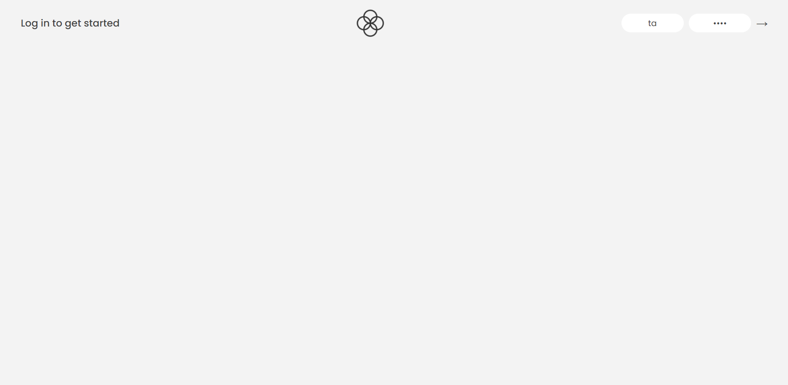
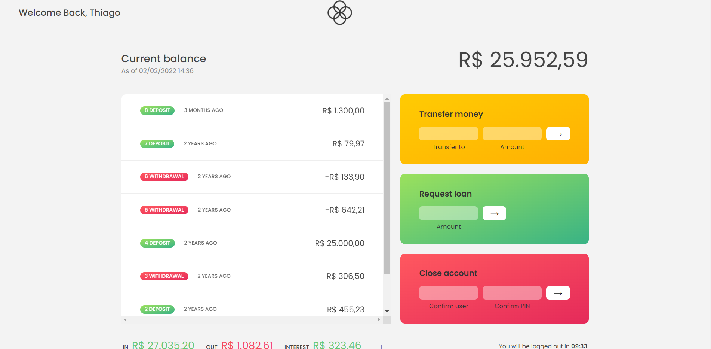

<h1 style="text-align: "center"; style="font-weight: bold;">Bankist App</h1>

<h1>Introdução</h1>

Esse é um projeto de um app de banco feito com javascript puro.

                 

 <a href="#sobre">Sobre</a> •
 <a href="#demonstração">Demonstração</a> •

## Sobre

O projeto é um app de um banco(bankist) com diversas funcionalidades, é possível fazer transferencias, pedir empréstimos, fechar conta, para testar temos duas contas (Thiago Andrade e Jessica Davis). 
Username: ta      password: 1111
Username: jd      password: 2222

## Demonstração

 <h2>Página feita com:</h2>

 Javascript

CSS

## Feito por Thiago  
